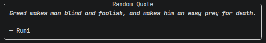

# 💻 Terminal CLI Randon Quote Fetcher

A lightweight, clean command-line tool that fetches a random, inspiring (or interesting) quote from an API and displays it in a beautiful, formatted panel right in your terminal.

## 📑 Features

* **Simple & Fast:** Fetches quotes instantly from the [DummyJSON API](https://dummyjson.com/).
* **Beautiful Output:** Uses the `rich` library to render quotes in clean, readable panels.
* **Modern Workflow:** Built with `uv` for lightning-fast dependency management.

## ✨ Installation

Ensure you have [uv](https://github.com/astral-sh/uv) installed.

Then, clone the repository and then sync the environment:

```bash
cd randon-quotes
uv sync

```

## ▶️ Running the App

Simply run the script using `uv`:

```bash
uv run main.py

```

## 📸 Screenshot



## 📑 Dependencies

This project uses:

* `requests` for API interaction.
* `rich` for terminal formatting.

## 🛡️ Licence

[MIT Licence](./LICENCE)

## 📖 Project Journey

*This project was written as part of my learning journey. It's nothing incredible, but I think it's kind of dudey. I hope you enjoy it, and it may be usable for somebody else's project learning journey.*
